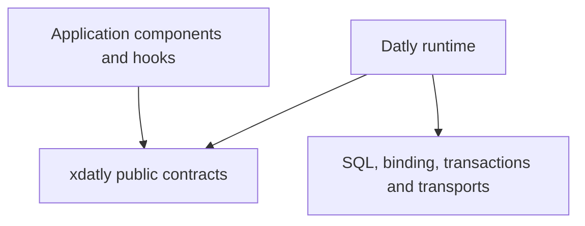

# SDK architecture

`github.com/viant/xdatly` is the public contract layer for Datly 1.0. Application
packages depend on these interfaces and types; `github.com/viant/datly` supplies
the runtime implementations. The SDK is a single Go module and must not import
the runtime. `dependency_budget_test.go` checks that dependency boundary.



## Components and invocation

The root `Component[I, O]` describes a typed input/output component. Custom
handlers implement `handler.Contract[I, O]`:

```go
Exec(ctx context.Context, sess handler.Session, input *I, output *O) error
```

`Session` exposes `Binder()` for invocation-scoped capabilities and `Response()`
for response operations. Component discovery, input binding, handler construction
and execution belong to the runtime, not this SDK. Go source discovery by itself
does not make a handler factory executable; the runtime/build integration supplies
the linked implementation.

## Capabilities and completion

Handlers can request focused `DML`, `Sequencer` and `Flusher` capabilities, or
the combined `Data` interface. DML buffers writes; sequencing allocates identifiers
before execution. A flush completes a transaction it owns and leaves a supplied
transaction to its owner. Queueing, flushing and confirmed commit are distinct
outcomes. Completion-aware hooks must use the outcome contract before publishing
commit-dependent external messages.

The `handler/mutation` contracts describe typed mutation policy and hook seams.
The runtime owns validation, binding, transaction orchestration and execution.
The SDK does not implement a second mutation engine.

## Package responsibilities

| Packages | Responsibility |
| --- | --- |
| `handler`, `handler/mutation` | Handler interfaces, scoped capabilities, mutation hooks and completion contracts |
| `bind`, `state`, `reader` | Input/state and query-selection contracts |
| `codec`, `predicate`, `docs` | Extensible conversion, predicates and API descriptions |
| `response` | Response status, errors and output operations |
| `async`, `exec` | Job and execution contracts |
| `tracing`, `logger`, `mbus` | Observation and messaging interfaces |
| `plugin`, `connector`, `differ`, `auth` | Optional integration and shared contract types |

Provider and plugin contracts are extension points; they do not replace the
runtime's component discovery, routing, dependency injection or resource owners.
SQL readers, caches, HTTP/MCP servers, JWT verification, job persistence and
OpenTelemetry exporters belong to runtime or native implementation packages.

## Module and release boundary

The existing `main` branch retains its current release line. The `v1` branch
contains this SDK using the canonical module path; `/v1` is not appended to imports.
See [RELEASING.md](RELEASING.md) for publication order and the distinction between
a branch push and a versioned release. The migration changes the previous
nested-module layout; consumers must use matching Datly and SDK revisions.
